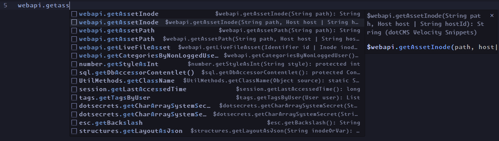

# Dotcms Velocity Snippets

This extension is a collection of ViewTool methods and directive snippets for use in Velocity template files when working with dotCMS. All snippets feature argument type information and tab stops for all known function calls and directives.

ViewTool methods were derived from either [dotCMS's JavaDocs](https://doc.dotcms.com/docs/22.03/javadocs/index.html), or the [dotCMS source code](https://github.com/dotCMS/core).

## Screenshot




## Quick Start

1. Install this extension: `ext install ethodellc.dotcms-velocity-snippets`
1. Install a VSCode extension that is able to parse Apache Velocity files
1. Add the below snippet to your `settings.json`. None of the existing Velocity LSPs have support for this extension out of the box, but is the standard file extension for Velocity files when working with dotCMS.
    ```json
    "files.associations": {
      "*.vtl": "velocity"
    },
    ```
1. Recommended: If you plan on using HTML markup to your velocity files, you can also enable Emmet support by adding this to `settings.json`:
    ```json
    "emmet.includeLanguages": {
      "velocity": "html",
    },
    ```

## Recommended Extensions

### [`luqimin.velocity`](https://marketplace.visualstudio.com/items?itemName=luqimin.velocity)

Out of the few Apache Velocity extensions, we've found this one to be the most reliable.

## Links

- [Apache Velocity](https://velocity.apache.org/)
- [dotCMS](https://www.dotcms.com)
- [Ethode](https://www.ethode.com)

## Running the Sample

- Run the `Run Extension` target in the Debug View, or press F5

## Building extension

1. `npm install -g @vscode/vsce`
1. `vsce package`
